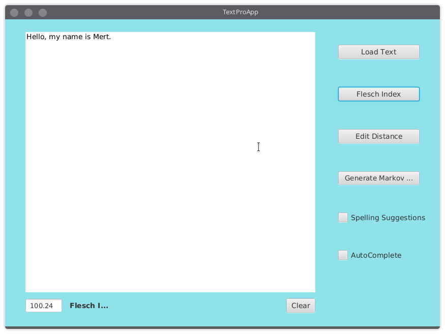

# Coursera-DataStructures-and-Performance

In this course, I will build a smart text editor/processor that incorporates “intelligent” behaviors of modern-day text interfaces including autocomplete, flagging misspelled words and spelling auto-correct.

##Samples of the Text Generation project.

###Flesch Index

> Flesch index a system used for evaluating readability and reading level of a document by examining word and sentence length, vocabulary, and phrases. Lower score is less readable, higher socre is much readable.

Here's an image of a higher flesch score:

Here's an image of a lower flesch score:

